# Set up and deploy services on K8S
**This tutorial shows how to set up Prometheus, Grafana and FastAPI on k8s using helm**

## How-to Guide Prometheus

### Start minikube
```shell
minikube start
kubectl create namespace monitoring
```
Output:
```shell
namespace/monitoring created
```

### Add the Prometheus Helm repository
```shell
helm repo add prometheus-community https://prometheus-community.github.io/helm-charts
helm repo update
```

### Download the chart into a folder
Make sure you are inside k8s folder first
```shell
mkdir -p prometheus_chart
cd prometheus_chart
helm pull prometheus-community/prometheus --untar
```

### Change values.yaml for customize
For example, if you want to deploy prometheus service with more than 1 replica.\
Searching for server component
```shell
server:
  replicaCount: 3
  statefulSet:
    enabled: true
```

Change Alerts configuration
```shell
serverFiles:
  ## Alerts configuration
  ## Ref: https://prometheus.io/docs/prometheus/latest/configuration/alerting_rules/
  alerting_rules.yml:
    groups:
      - name: System alerts
        rules:
          - alert: NodeOutOfMemory
            expr: node_memory_MemAvailable_bytes / node_memory_MemTotal_bytes * 100 < 5
            for: 1m
            labels:
              severity: warning
            annotations:
              summary: Node out of memory
              description: Node memory has reached {{ humanize $value}}%
          - alert: HighCPUUsage
            expr: avg(rate(process_cpu_seconds_total[1m])) > 0.9
            for: 2m
            labels:
              severity: warning
            annotations:
              summary: "High CPU usage on {{ $labels.instance }}"
              description: "CPU usage is above 90% for 2 minutes on {{ $labels.instance }}."
          - alert: InstanceDown
            expr: up == 0
            for: 1m
            labels:
              severity: critical
            annotations:
              summary: "Instance {{ $labels.instance }} is down"
              description: "{{ $labels.job }} on {{ $labels.instance }} has been unreachable for more than 1 minute."
          - alert: HighMemoryUsage
            expr: (node_memory_Active_bytes / node_memory_MemTotal_bytes) > 0.85
            for: 2m
            labels:
              severity: warning
            annotations:
              summary: "High memory usage on {{ $labels.instance }}"
              description: "Memory usage is above 85% for 2 minutes on {{ $labels.instance }}"
      - name: Containers
        rules:
          - alert: JenkinsHighMemory
            expr: sum(rate(container_cpu_usage_seconds_total{name="jenkins"}[5m]))*100 > 2
            for: 30s
            labels:
              severity: warning
            annotations:
              summary: Jenkins high memory usage
              description: Jenkins memory consumption is at {{ humanize $value}}%
```

### Install prometheus using helm under monitoring namespace
```shell
helm install prometheus-k8s ./prometheus --namespace monitoring
```
Expected output:
```shell
NAME: prometheus-k8s
LAST DEPLOYED: Sun Jun 15 15:49:45 2025
NAMESPACE: monitoring
STATUS: deployed
REVISION: 1
TEST SUITE: None
NOTES:
The Prometheus server can be accessed via port 80 on the following DNS name from within your cluster:
prometheus-k8s-server.monitoring.svc.cluster.local
```

### Check prometheus installation
```shell
kubectl get pods -n monitoring
```
Expected output, in case there are 3 prometheus-k8s-server 0 1 and 2 corresponding to 3 replicas:
```shell
NAME                                                     READY   STATUS    RESTARTS   AGE
prometheus-k8s-alertmanager-0                            1/1     Running   0          3m22s
prometheus-k8s-kube-state-metrics-5d4b94855b-5pb5v       1/1     Running   0          3m22s
prometheus-k8s-prometheus-node-exporter-psrkx            1/1     Running   0          3m22s
prometheus-k8s-prometheus-pushgateway-5b7cb6bd7f-ph52q   1/1     Running   0          3m22s
prometheus-k8s-server-0                                  2/2     Running   0          3m22s
prometheus-k8s-server-1                                  2/2     Running   0          109s
prometheus-k8s-server-2                                  2/2     Running   0          76s
```

```shell
kubectl get svc -n monitoring
```
Expected output:
```shell
NAME                                      TYPE        CLUSTER-IP      EXTERNAL-IP   PORT(S)    AGE
prometheus-k8s-alertmanager               ClusterIP   10.105.29.184   <none>        9093/TCP   6m52s
prometheus-k8s-alertmanager-headless      ClusterIP   None            <none>        9093/TCP   6m52s
prometheus-k8s-kube-state-metrics         ClusterIP   10.110.228.67   <none>        8080/TCP   6m52s
prometheus-k8s-prometheus-node-exporter   ClusterIP   10.110.35.10    <none>        9100/TCP   6m52s
prometheus-k8s-prometheus-pushgateway     ClusterIP   10.99.159.172   <none>        9091/TCP   6m52s
prometheus-k8s-server                     ClusterIP   10.105.69.58    <none>        80/TCP     6m52s
prometheus-k8s-server-headless            ClusterIP   None            <none>        80/TCP     6m52s
```

### Convert the prometheus service from ClusterIP to NodePort service
```shell
kubectl expose service prometheus-k8s-server \
  --namespace monitoring \
  --type=NodePort \
  --target-port=9090 \
  --name=prometheus-k8s-server-ext
```
Expected output:
```shell
service/prometheus-k8s-server-ext exposed

kubectl get svc -n monitoring
>> Output
NAME                                      TYPE        CLUSTER-IP      EXTERNAL-IP   PORT(S)        AGE
prometheus-k8s-alertmanager               ClusterIP   10.105.29.184   <none>        9093/TCP       6h25m
prometheus-k8s-alertmanager-headless      ClusterIP   None            <none>        9093/TCP       6h25m
prometheus-k8s-kube-state-metrics         ClusterIP   10.110.228.67   <none>        8080/TCP       6h25m
prometheus-k8s-prometheus-node-exporter   ClusterIP   10.110.35.10    <none>        9100/TCP       6h25m
prometheus-k8s-prometheus-pushgateway     ClusterIP   10.99.159.172   <none>        9091/TCP       6h25m
prometheus-k8s-server                     ClusterIP   10.105.69.58    <none>        80/TCP         6h25m
prometheus-k8s-server-ext                 NodePort    10.102.153.57   <none>        80:32492/TCP   34s
prometheus-k8s-server-headless            ClusterIP   None            <none>        80/TCP         6h25m
```

### Enjoy prometheus
Get k8s ip node
```shell
minikube ip
```
Now your prometheus on k8s is ready
```shell
http://192.168.49.2:32492
```
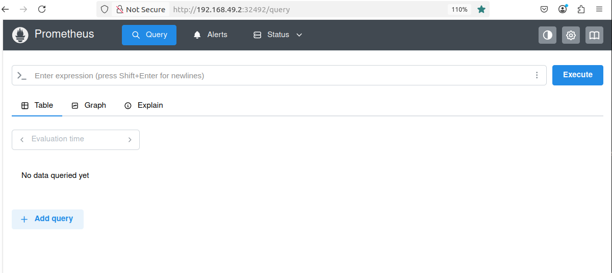
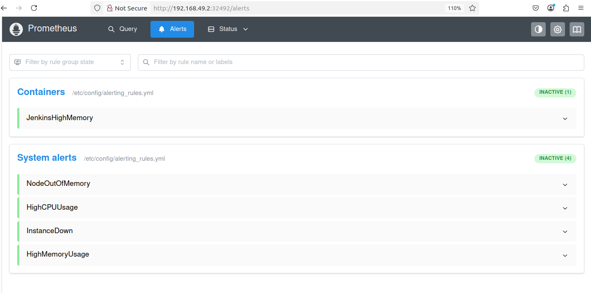

## How-to Guide Grafana
### Grafana set up
Do the same with Promethus
```shell
helm repo add grafana https://grafana.github.io/helm-charts
mkdir -p grafana_chart
cd grafana_chart/
helm pull grafana/grafana --untar
helm install grafana-k8s ./grafana --namespace monitoring
kubectl expose service grafana-k8s \
  --namespace monitoring \
  --type=NodePort \
  --target-port=3000 \
  --name=grafana-k8s-ext
```

### Output logs
When install Grafana
```shell
NOTES:
1. Get your 'admin' user password by running:

   kubectl get secret --namespace monitoring grafana-k8s -o jsonpath="{.data.admin-password}" | base64 --decode ; echo


2. The Grafana server can be accessed via port 80 on the following DNS name from within your cluster:

   grafana-k8s.monitoring.svc.cluster.local

   Get the Grafana URL to visit by running these commands in the same shell:
     export POD_NAME=$(kubectl get pods --namespace monitoring -l "app.kubernetes.io/name=grafana,app.kubernetes.io/instance=grafana-k8s" -o jsonpath="{.items[0].metadata.name}")
     kubectl --namespace monitoring port-forward $POD_NAME 3000

3. Login with the password from step 1 and the username: admin
```
After finish all steps
```shell
kubectl get svc -n monitoring
>> Output
NAME                                      TYPE        CLUSTER-IP      EXTERNAL-IP   PORT(S)        AGE
grafana-k8s                               ClusterIP   10.106.5.97     <none>        80/TCP         2m59s
grafana-k8s-ext                           NodePort    10.97.249.175   <none>        80:32591/TCP   15s
prometheus-k8s-alertmanager               ClusterIP   10.105.29.184   <none>        9093/TCP       6h48m
prometheus-k8s-alertmanager-headless      ClusterIP   None            <none>        9093/TCP       6h48m
prometheus-k8s-kube-state-metrics         ClusterIP   10.110.228.67   <none>        8080/TCP       6h48m
prometheus-k8s-prometheus-node-exporter   ClusterIP   10.110.35.10    <none>        9100/TCP       6h48m
prometheus-k8s-prometheus-pushgateway     ClusterIP   10.99.159.172   <none>        9091/TCP       6h48m
prometheus-k8s-server                     ClusterIP   10.105.69.58    <none>        80/TCP         6h48m
prometheus-k8s-server-ext                 NodePort    10.102.153.57   <none>        80:32492/TCP   23m
```
Now your Grafana service is ready at
```shell
http://192.168.49.2:32591
```

### Login to Grafana
username: admin\
password: available at
```shell
kubectl get secret --namespace monitoring grafana-k8s -o jsonpath="{.data.admin-password}" | base64 --decode ; echo
```
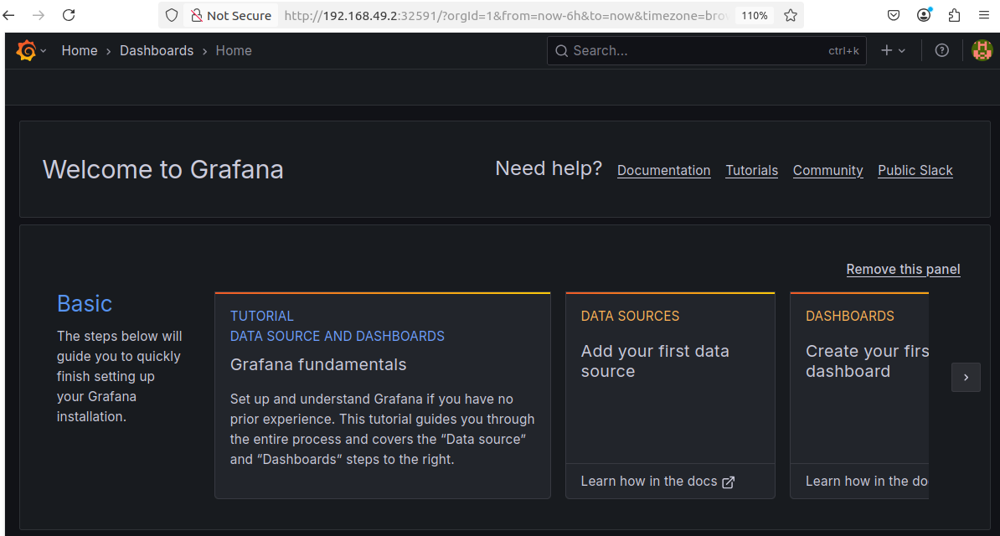

### Add Prometheus connection
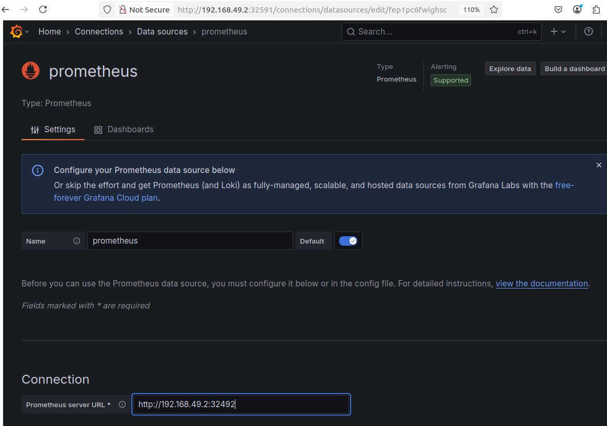
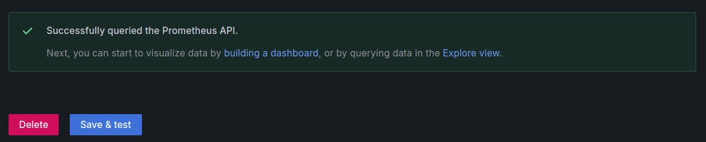

### Try import dashboard from Grafana.com
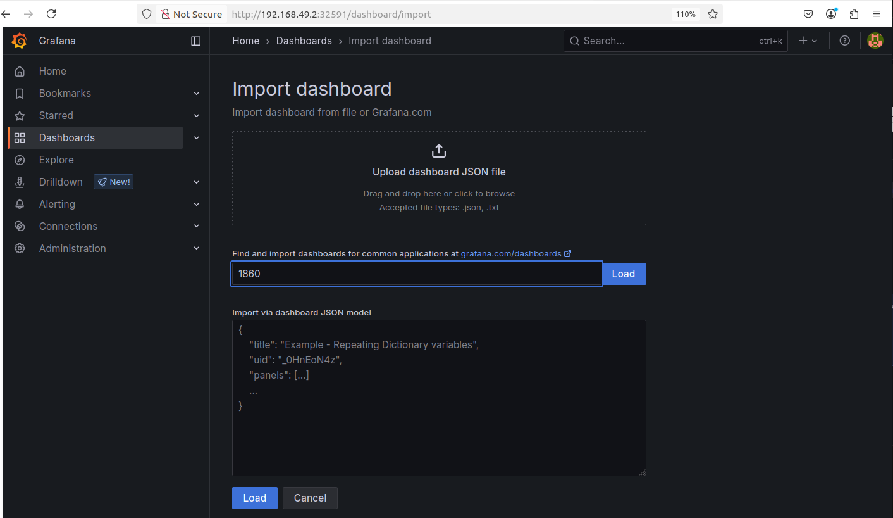
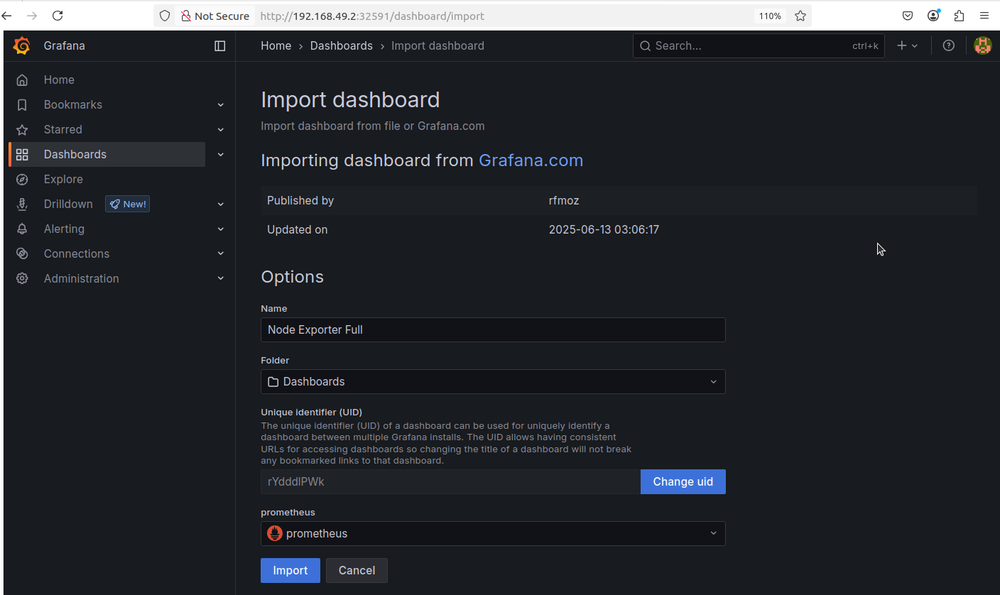
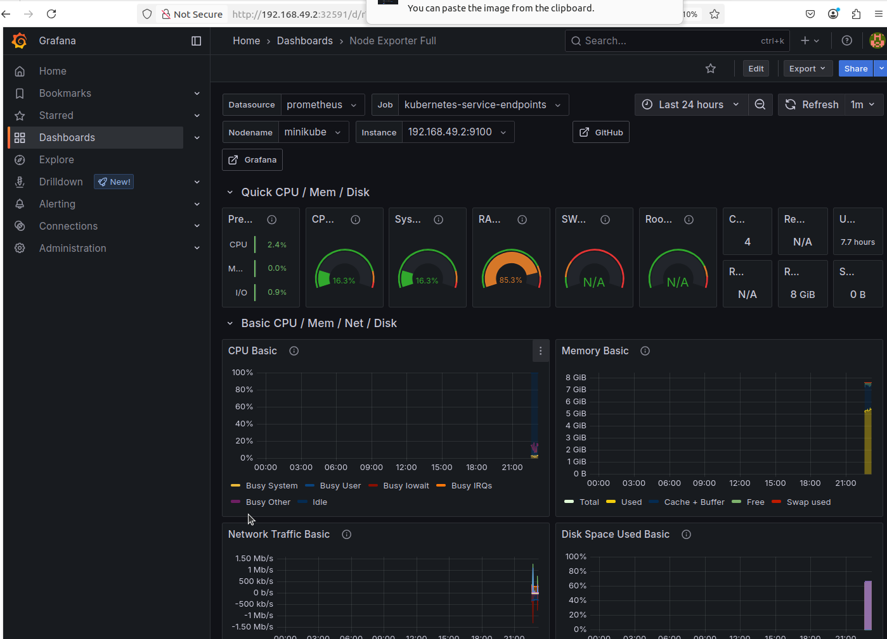
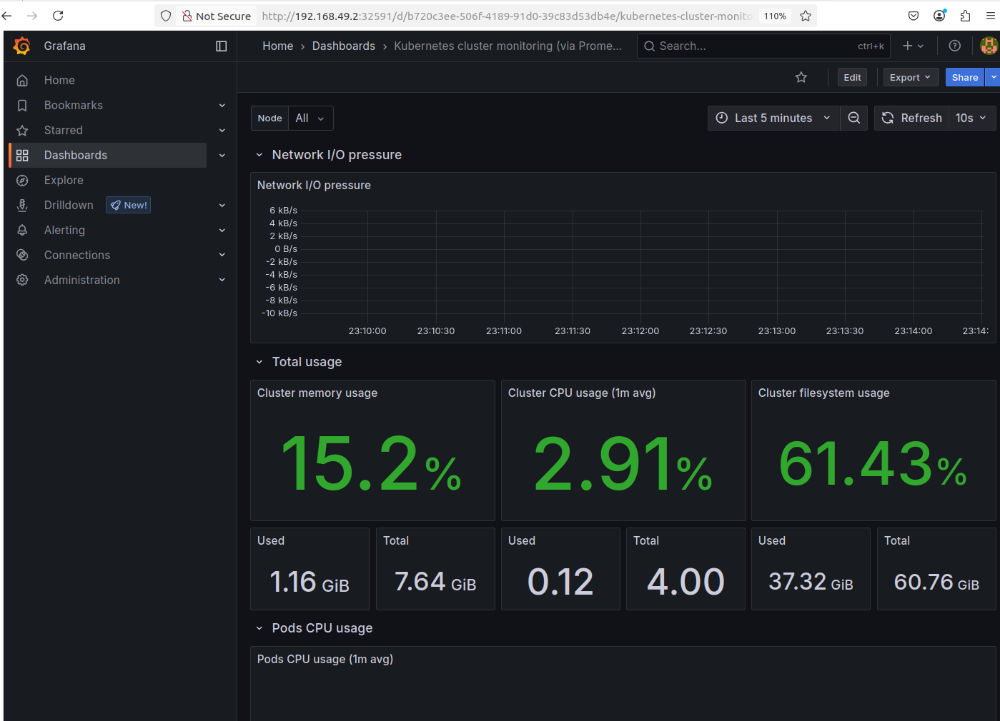

### Customize alert rules from prometheus
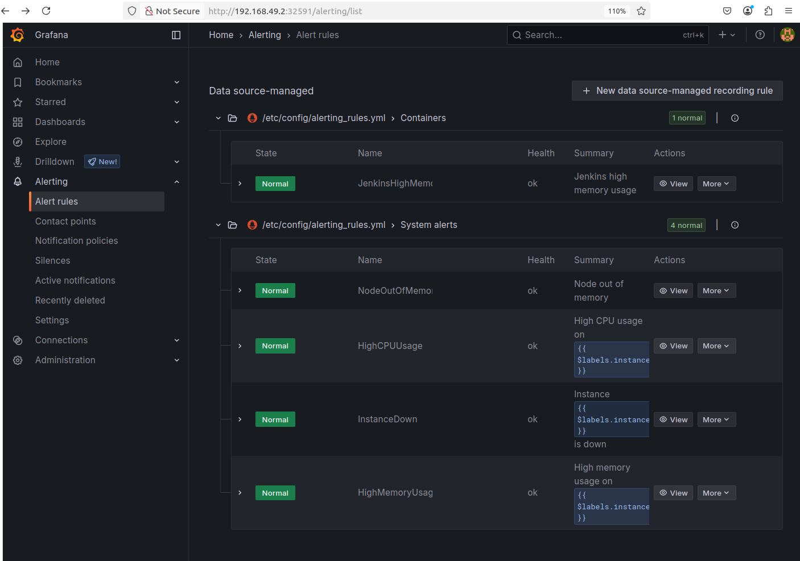

## How-to Guide Fast API

### Create namespace
```shell
kubectl create namespace deployed-api
```
Output:
```shell
namespace/deployed-api created
```

### Add the Helm chart
```shell
helm create stroke-api-chart
cd stroke-api-chart
```
Remove unnecessary files:
```shell
rm templates/hpa.yaml templates/tests/* templates/ingress.yaml templates/serviceaccount.yaml
```

### Customize values.yaml, templates/deployment.yaml and templates/services.yaml
Since Kubernetes (Minikube) runs in a VM or a containerized environment and to run Model FastAPI serving,\
we need MLflow and Jaeger services running with docker run or docker-compose are not inside the same network as your Kubernetes pods.\
For model api deployed k8s to reach Mlflow and export tracing to Jaeger, make it reach your own host’s IP directly. \
(Also check that firewall is not blocking the connection)\
**Get your host machine's IP address**
```shell
ip addr | grep inet
```
Look for something like inet 192.168.1xx.xx\
Mine is **192.168.100.61**

**values.yaml**
```shell
replicaCount: 3 # deploy model api serving on k8s with 3 replica

image:
  repository: tamvlb/stroke_pred_api
  tag: latest
  pullPolicy: Always

service:
  type: NodePort # for end-user access
  port: 80
  appPort: 7000 # Model FastAPI port
  metricPort: 8001 # FastAPI metrics port 

env:
  - name: MLFLOW_TRACKING_URI
    value: http://192.168.100.61:5001 #http://[host’s IP]:[mlflow port]
  - name: JAEGER_URI
    value: http://192.168.100.61:4318/v1/traces #http://[host’s IP]:[jaeger otlp exporter end point]

ingress:
  enabled: false
```

**templates/deployment.yaml**
```shell
apiVersion: apps/v1
kind: Deployment
metadata:
  name: {{ .Release.Name }}
  labels:
    app: {{ .Chart.Name }}
spec:
  replicas: {{ .Values.replicaCount }}  
  selector:
    matchLabels:
      app: {{ .Chart.Name }} 
  template:
    metadata:
      labels:
        app: {{ .Chart.Name }} 
    spec:
      containers:
        - name: {{ .Release.Name }}
          image: "{{ .Values.image.repository }}:{{ .Values.image.tag }}"
          imagePullPolicy: {{ .Values.image.pullPolicy }}
          ports:
            - containerPort: {{ .Values.service.appPort }}  
          env:
            {{- range .Values.env }}
            - name: {{ .name }}
              value: "{{ .value }}"
{{- end }}
```

**templates/services.yaml**
```shell
apiVersion: v1
kind: Service
metadata:
  name: {{ .Release.Name }}
spec:
  type: {{ .Values.service.type }}
  selector:
    app: {{ .Chart.Name }}
  ports:
    - protocol: TCP
      name: appport
      port: {{ .Values.service.appPort }}
      targetPort: {{ .Values.service.appPort }}
    - protocol: TCP
      name: metricport
      port: {{ .Values.service.metricPort }}
      targetPort: {{ .Values.service.metricPort }}
  type: NodePort
```

### Install API helm chart
```shell
helm install stroke-api-k8s . -n deployed-api
```
Expected output:
```shell
NAME: stroke-api-k8s
LAST DEPLOYED: Mon Jun 16 23:27:51 2025
NAMESPACE: deployed-api
STATUS: deployed
REVISION: 1
TEST SUITE: None
```

### Check installation status
```shell
kubectl get pods -n deployed-api
```
Expected output:
```shell
NAME                              READY   STATUS    RESTARTS   AGE
stroke-api-k8s-5f56dd8d67-6c4wf   1/1     Running   0          52s
stroke-api-k8s-5f56dd8d67-mbx7j   1/1     Running   0          52s
stroke-api-k8s-5f56dd8d67-zlc24   1/1     Running   0          52s
```

```shell
kubectl get svc -n deployed-api
```
Expected output:
```shell
NAME             TYPE       CLUSTER-IP      EXTERNAL-IP   PORT(S)                         AGE
stroke-api-k8s   NodePort   10.106.118.77   <none>        7000:32134/TCP,8001:30714/TCP   10s
```
Now you can access to your Model API deployed on k8s through
```shell
http://192.168.49.2:32134/docs # Model serving API
http://192.168.49.2:30714/ # FastAPI Metric
```
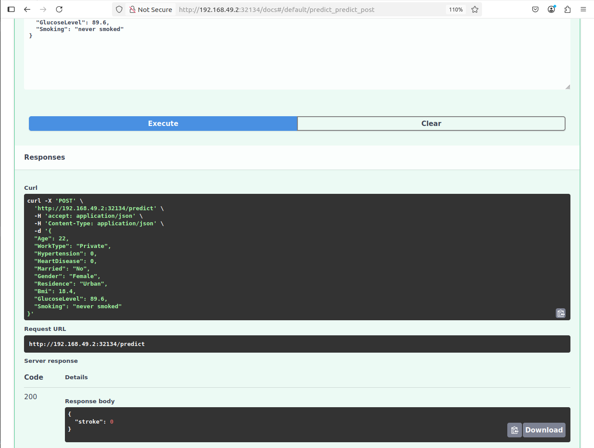


