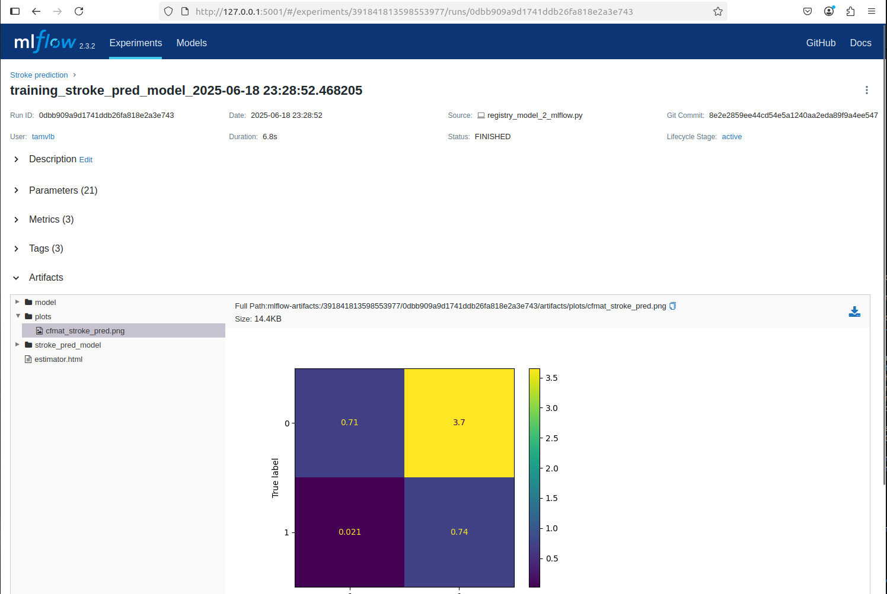
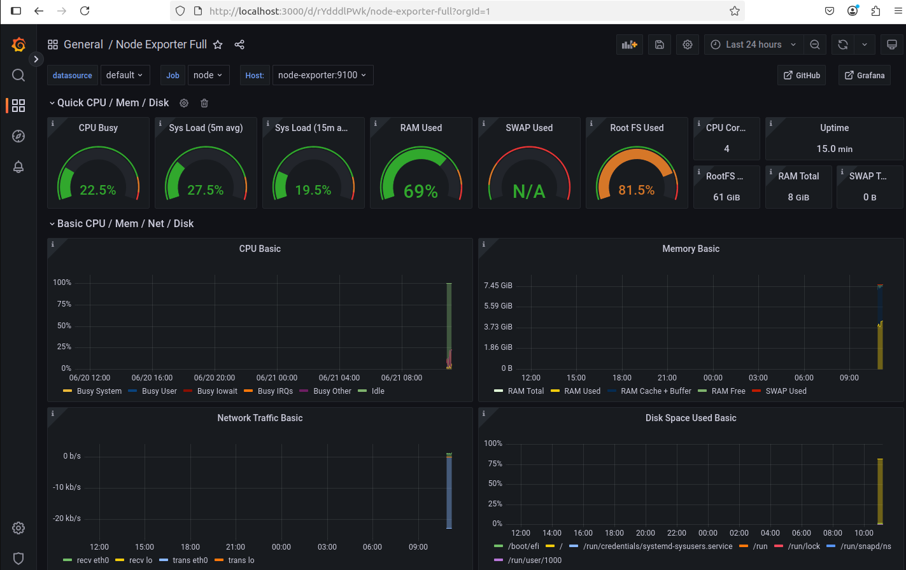
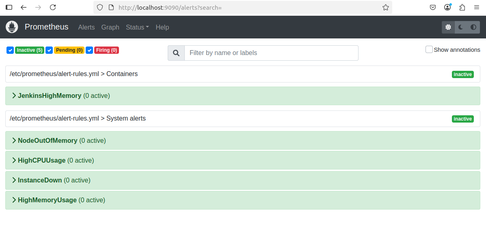
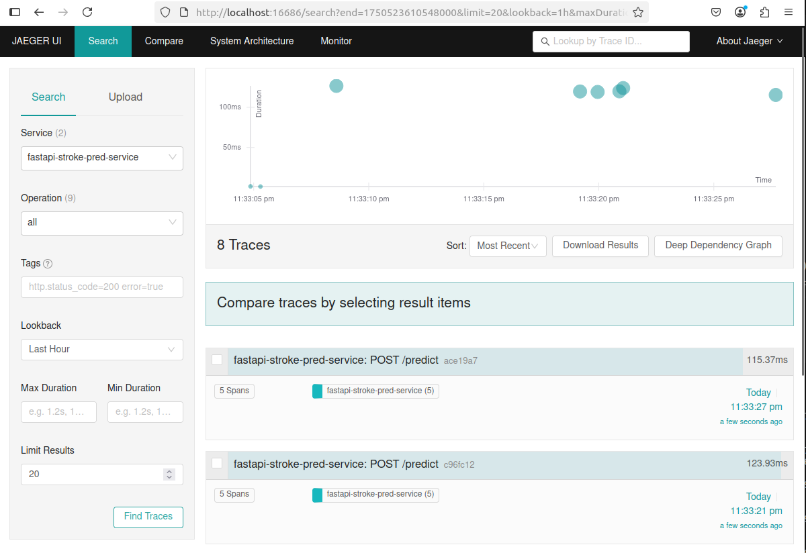
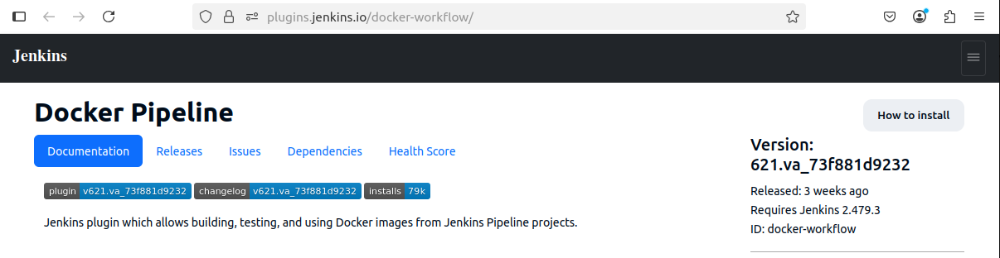
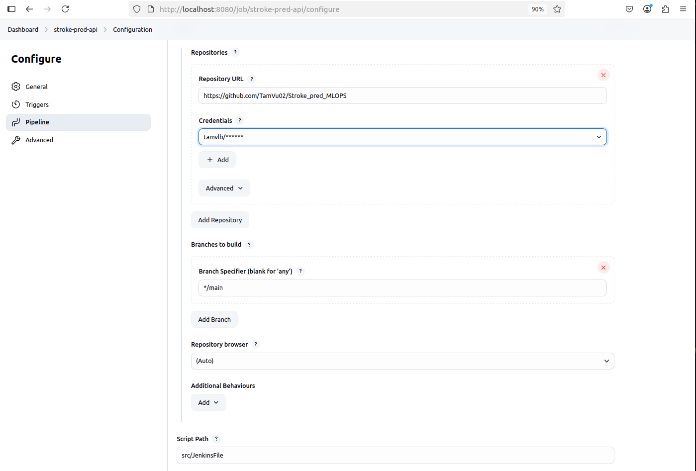
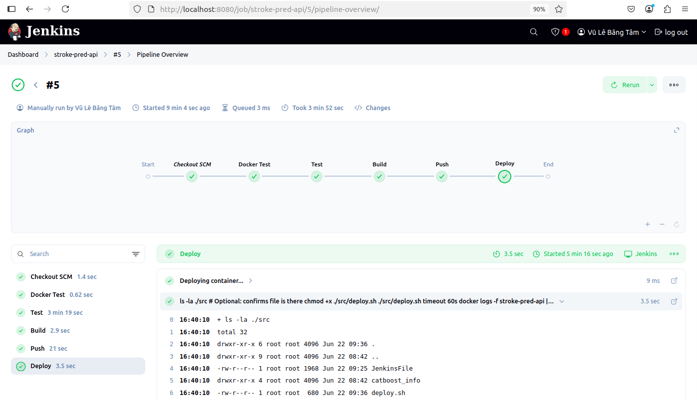
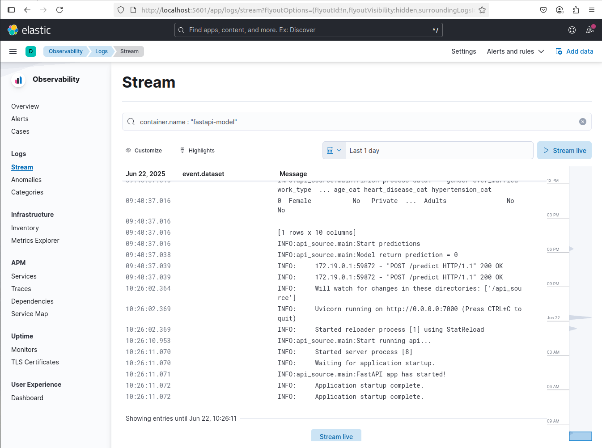

# Set up services using Docker
**Make sure you are under /service directory first!**

## MLFLOW
### Set up mlflow
```shell
cd mlflow/
docker-compose up --build
```
Access to mlflow at
```shell
http://localhost:5001
```


### Run training script to registry model to mlflow
```shell
python ../../src/train_src/registry_model_2_mlflow.py
```
Example of my model experiment


## MODEL API SERVING
### Set up FastAPI
```shell
cd model_api_serving/
docker-compose up --build
```
Access to fast api for model serving at
```shell
http://localhost:7000/docs
```
And API Metrics at
```shell
http://localhost:8001/
```

### Try out model
```shell
curl -X 'POST' \
  'http://localhost:7000/predict' \
  -H 'accept: application/json' \
  -H 'Content-Type: application/json' \
  -d '{
  "Age": 22,
  "WorkType": "Private",
  "Hypertension": 0,
  "HeartDisease": 0,
  "Married": "No",
  "Gender": "Female",
  "Residence": "Urban",
  "Bmi": 18.4,
  "GlucoseLevel": 89.6,
  "Smoking": "never smoked"
}'
```
Expected output
```shell
{"stroke":0}
```

## PROMETHEUS, GRAFANA & JAEGER
### Set up services
```shell
docker compose -f prom-graf-jaeger-docker-compose.yaml up -d
```
Try out services
```shell:
http://localhost:3000 # Grafana
http://localhost:9090 # Prometheus
http://localhost:16686 # Jaeger
```




## JENKINS
### Set up jenkins
```shell
cd jenkins/
docker-compose up --build
```
Access to jenkins at
```shell
http://localhost:8080/
```


### Installation plugins
Make sure to install required plugins: Docker pipline


### Set up build,test and deploy
Configure Jenkins Pipeline

Build JenkinsFile for CI/CD
```shell
Test using pytest -> Build Image -> Push Image to DockerHub -> Deploy FastAPI using deploy script in /src
```


## ELK
### Set up services
```shell
cd elk/
docker compose -f elk-docker-compose.yml up -d # Set up ELastic search and Kibana
docker compose -f elk-docker-compose.yml -f extensions/filebeat/filebeat-compose.yml up # Set up Filebeat
```
Access to services at
```shell
http://localhost:5601
```
Now you can see your container logs, below is FastAPI logs

